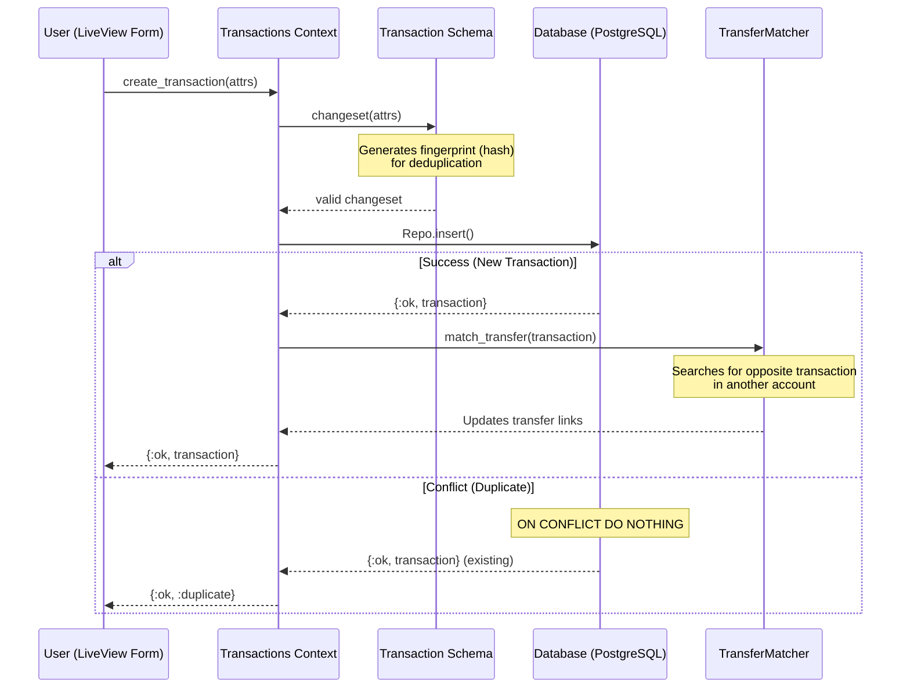
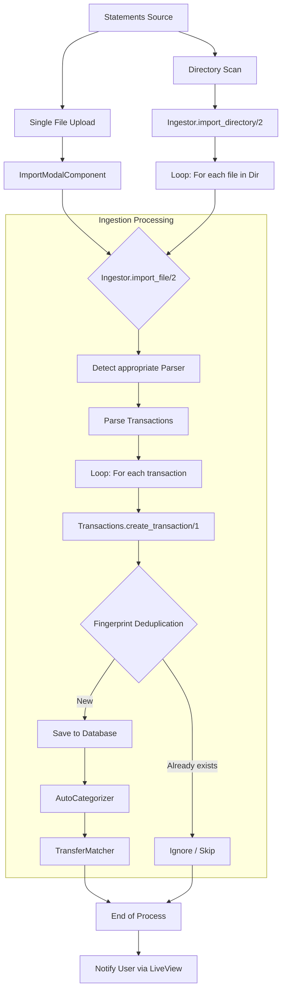
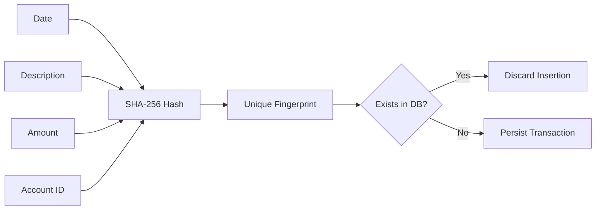

# Transaction Insertion Flow

This document details the processes for adding transactions to CashLens, both manually and via bank statement imports.

## 1. Manual Transaction Flow
Occurs when a user creates a transaction using the web interface form.

---

## 2. Statement Import Flow
Handles bulk transaction creation from files or entire directories.

---

## 3. Deduplication Logic (Fingerprint)
The system ensures that the same transaction is not imported multiple times by generating a unique hash.

**Key Architectural Insights:**
- **Native Deduplication:** The `Transaction` schema automatically calculates the `fingerprint` in the changeset, and the database has a unique index on this field.
- **Smart Transfers:** The `TransferMatcher` attempts to link transfer legs (e.g., an exit from one account and an entry in another) right after insertion.
- **Auto-Categorization:** During import, the system tries to infer the category based on keywords defined in existing categories.
